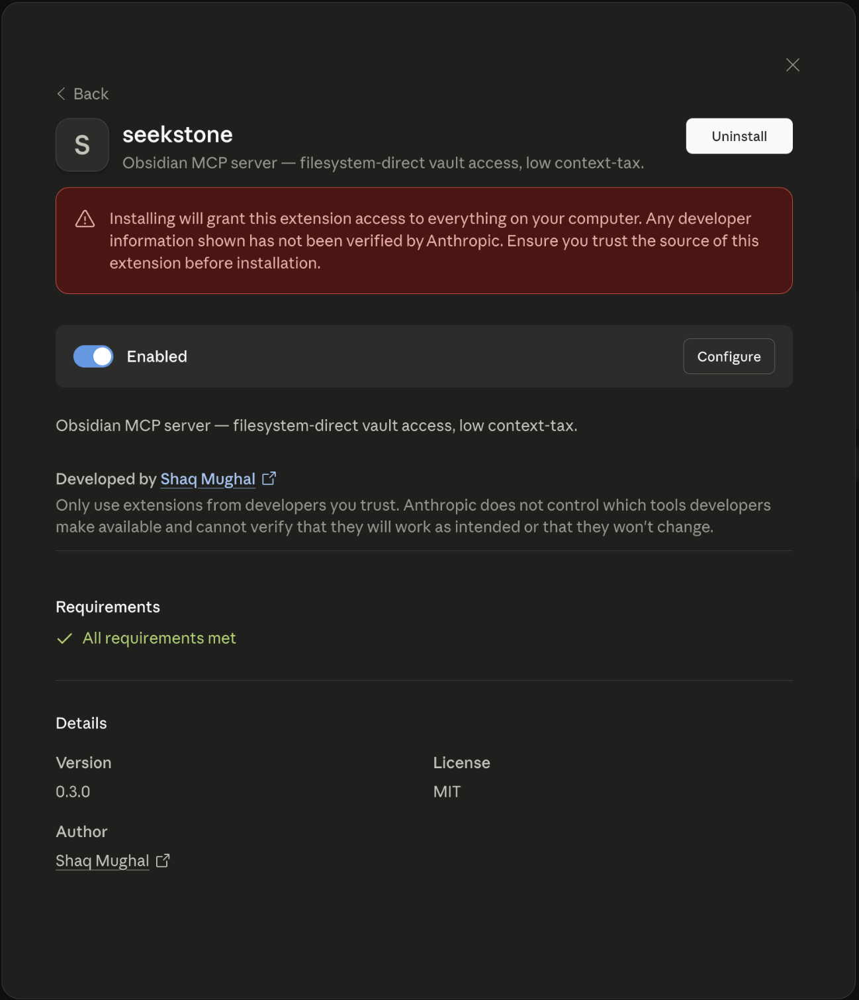

<p align="center">
  <picture>
    <source media="(prefers-color-scheme: dark)" srcset="brand/seekstone-wordmark-dark.svg" />
    
  </picture>
</p>

<p align="center"><strong>The Obsidian MCP server for Claude — search and edit your vault without burning context.</strong></p>
<p align="center"><em>Filesystem-direct · No plugins · No Obsidian app required · macOS · Linux · Windows</em></p>

<p align="center">
  <a href="https://www.npmjs.com/package/obsidian-mcp-seekstone"></a>
  <a href="https://www.npmjs.com/package/seekstone"></a>
  <a href="https://www.npmjs.com/package/seekstone"></a>
  <a href="https://www.npmjs.com/package/seekstone"></a>
  <a href="https://codecov.io/gh/shaqmughal/seekstone"></a>
  <a href="https://app.codacy.com/gh/shaqmughal/seekstone/dashboard?utm_source=gh&utm_medium=referral&utm_content=&utm_campaign=Badge_grade"></a>
  <a href="https://socket.dev/npm/package/seekstone"></a>
  <a href="https://snyk.io/test/github/shaqmughal/seekstone"></a>
  <a href="https://github.com/shaqmughal/seekstone/actions/workflows/ci.yml"></a>
  <a href="https://scorecard.dev/viewer/?uri=github.com/shaqmughal/seekstone"></a>
  <a href="https://www.bestpractices.dev/projects/13166"></a>
  <a href="LICENSE"></a>
  
  <a href="https://glama.ai/mcp/servers/shaqmughal/seekstone"></a>
  <a href="https://buymeacoffee.com/shaqmughal"></a>
</p>

---

## What is Seekstone?

**Seekstone is an Obsidian MCP server** — it gives Claude (and any [Model Context Protocol](https://modelcontextprotocol.io) client) direct read and write access to your Obsidian vault. No Obsidian app needs to be open, no plugins are required, and nothing leaves your machine.

It reads your vault **directly from disk** rather than routing through the Obsidian Local REST API plugin. The practical difference: a search that returns ~1.75 MB and ~459,000 tokens via the REST plugin returns **~3 KB and ~800 tokens** via Seekstone — a **~575× reduction**. Claude can search and read your entire note library without burning most of its context window on a single tool call.

**Two npm names, one server** — published under both for discoverability:

| Package | Install command |
|---|---|
| [`obsidian-mcp-seekstone`](https://www.npmjs.com/package/obsidian-mcp-seekstone) | `npx -y obsidian-mcp-seekstone` |
| [`seekstone`](https://www.npmjs.com/package/seekstone) | `npx -y seekstone` |

---

## Why Seekstone? The numbers.

Most Obsidian MCP servers return **full note content for every search hit**. On a broad query that's megabytes of text your LLM has to process — most of it irrelevant, all of it burning context window.

Seekstone returns ~200-character ranked excerpts instead. We benchmarked Seekstone against 5 popular Obsidian MCP servers on a real vault (1,955 notes, 20 runs each):

**Search latency — warm median (lower is better)**

| Server | Architecture | Warm p50 | vs Seekstone |
|---|---|---|---|
| **Seekstone** | in-process MiniSearch index | **1.4–3.2 ms** | — |
| [obsidian-mcp-server](https://github.com/cyanheads/obsidian-mcp-server) | REST API | 45–71 ms | ~25–32× slower |
| [mcp-obsidian](https://github.com/MarkusPfundstein/mcp-obsidian) | REST API | 53–109 ms | ~35–50× slower |
| [obsidian-mcp-pro](https://github.com/rps321321/obsidian-mcp-pro) | fs-direct subprocess | 100–107 ms | ~45× slower |
| [mcpvault](https://github.com/bitbonsai/mcpvault) | fs-direct subprocess | 181–217 ms | ~130× slower |
| [obsidian-mcp](https://github.com/StevenStavrakis/obsidian-mcp) | fs-direct subprocess | 214–224 ms | ~160× slower |

The gap is architectural: every competitor spawns a subprocess or makes HTTP round-trips per query. Seekstone holds a warm MiniSearch index in-process — no IPC, no network.

**Search payload — bytes returned per query (lower is better)**

| Server | Range | vs Seekstone |
|---|---|---|
| **Seekstone** | **3–5 KB** | — |
| mcpvault | 3–4 KB | ~1× |
| obsidian-mcp-pro | 3–180 KB | up to 28× |
| obsidian-mcp-server | 81–135 KB | ~28× |
| obsidian-mcp | 1 KB–823 KB | up to 56× |
| mcp-obsidian | 509 KB–3.84 MB | up to **478×** |

REST-proxy servers return full note content for every match. A single "deep work" query via mcp-obsidian returned 3.84 MB — over a million tokens. Seekstone returns the same query in 4 KB.

The harness and methodology are [open source](packages/harness) — run it against your own vault.

---

## Install

Choose the method that suits you best.

### Option 1 — One-click (Claude Desktop, no terminal needed)

1. Download `seekstone.mcpb` from [GitHub Releases](https://github.com/shaqmughal/seekstone/releases/latest)
2. Open it with Claude Desktop — double-click in Finder, or right-click → Open With → Claude Desktop
3. Pick your Obsidian vault folder when prompted

You'll know it worked when seekstone appears in Claude's toolbar. No JSON editing, no terminal, no Node.js required.



### Option 2 — Guided setup (recommended for CLI users)

Open **Terminal** (macOS: `Cmd+Space`, type "Terminal", press Enter) and run:

```bash
npx -y obsidian-mcp-seekstone init
```

You'll know it worked when Seekstone appears in Claude's toolbar under the plug icon.

Seekstone reads Obsidian's own vault registry to detect your vault, validates it, and either prints the config block to paste or patches Claude Desktop directly:

```bash
# Auto-detect vault, print config to paste
npx -y obsidian-mcp-seekstone init

# Auto-detect vault, patch Claude Desktop in place (with backup)
npx -y obsidian-mcp-seekstone init --write

# Specify vault explicitly if you have multiple
npx -y obsidian-mcp-seekstone init --vault "/path/to/vault"

# Auto-configure Claude Code in one step (auto-detects vault, runs claude mcp add)
npx -y obsidian-mcp-seekstone init --client code --write

# Or just print the Claude Code command without running it
npx -y obsidian-mcp-seekstone init --client code
```

### Option 3 — Manual config (Claude Desktop)

Add to `claude_desktop_config.json` (Settings → Developer → Edit Config):

```json
{
  "mcpServers": {
    "seekstone": {
      "command": "npx",
      "args": ["-y", "obsidian-mcp-seekstone"],
      "env": { "SEEKSTONE_VAULT": "/absolute/path/to/your/vault" }
    }
  }
}
```

### Option 4 — Claude Code

Auto-detects your vault and configures Claude Code in one command:

```bash
npx -y obsidian-mcp-seekstone init --client code --write
```

Or manually, if you prefer to specify the vault path explicitly:

```bash
claude mcp add seekstone --env SEEKSTONE_VAULT=/absolute/path/to/your/vault -- npx -y obsidian-mcp-seekstone
```

---

After installing, restart the client. On startup Seekstone walks the vault, builds an in-memory full-text index (a few seconds for thousands of notes), and keeps it live as you edit. The eight tools below are then available to Claude.

Requires [Node.js](https://nodejs.org) ≥ 22 for the CLI options. The one-click `.mcpb` bundle has no external requirements.

---

## What can Claude do with your vault?

Once Seekstone is connected, you can ask Claude things like:

- **"Search my notes for everything about [topic] and give me a summary"** — uses `search`, returns ranked excerpts, not full files
- **"Find all notes tagged #project and list their titles"** — uses `list_notes` with a tag filter
- **"Read my note on [topic] and suggest improvements"** — uses `read_note`
- **"Create a new meeting note for today with a standard template"** — uses `create_note`
- **"Add a summary section to the bottom of [note]"** — uses `append_note`, never touches frontmatter
- **"Move all notes in /inbox to /archive/[year]"** — uses `move_note`
- **"Update the status field in this note's frontmatter to 'done'"** — uses `patch_frontmatter`, preserves key order and quote style
- **"Delete the scratch note at [path]"** — uses `delete_note`

Claude never sees your full vault at once — it searches and reads selectively, so even large vaults (10k+ notes) stay within context budget.

---

## Tools

### Read

| Tool | Description |
|---|---|
| `search` | Full-text search. Returns ranked ~200-char excerpts, not full notes. Fuzzy, prefix, and phrase queries. |
| `read_note` | Read the full content of a note by vault-relative path. Supports returning a single section, block, or line range. |
| `list_notes` | List notes, optionally filtered by folder prefix or tag. |
| `list_tags` | List all tags in the vault sorted by usage count (or alphabetically). |
| `outline_note` | Return a note's heading and block structure without its full content — cheap navigation before a targeted read. |
| `get_backlinks` | Find all notes that link to a given note. |
| `get_links` | List all outgoing wikilinks and markdown links from a note. |
| `get_periodic_note` | Read today's (or any date's) daily, weekly, or monthly note. |

### Write

| Tool | Description |
|---|---|
| `create_note` | Create a note (optional frontmatter + body); parent directories are created automatically. |
| `delete_note` | Permanently delete a note. **Irreversible.** |
| `move_note` | Move or rename a note; destination directories are created automatically. |
| `append_note` | Append text to a note body without touching frontmatter. |
| `patch_frontmatter` | Set, update, or delete frontmatter keys without reordering existing keys or changing quote style. |
| `patch_note` | Insert text immediately after a heading without touching frontmatter. |
| `replace_in_note` | Replace the first occurrence of a word or phrase in the note body. |
| `append_periodic_note` | Append to today's periodic note, creating it from a template if it doesn't yet exist. |

Seekstone is the only Obsidian MCP server in our benchmark set to implement `list_tags`, `outline_note`, `get_backlinks`, and `get_links`. Every other tested server supports only search, read, list, and write.

---

## Configuration

| Variable | Required | Description |
|---|---|---|
| `SEEKSTONE_VAULT` | Yes | Absolute path to your Obsidian vault. |
| `SEEKSTONE_LOG_LEVEL` | No | `error` \| `warn` \| `info` (default) \| `debug`. |
| `SEEKSTONE_LOG_FILE` | No | Absolute path; when set, JSON-line logs are appended here (size-rotated). |
| `SEEKSTONE_WATCH_POLL` | No | Set to `1` to stat-poll for changes instead of native OS events — slower but reliable on network drives, WSL, and some containers. |

---

## How it works

Seekstone walks the vault with `fast-glob`, parses each note's frontmatter (byte-aware, so writes can prove the frontmatter region is byte-identical pre- and post-write), and builds a [MiniSearch](https://github.com/lucaong/minisearch) full-text index in memory. Search returns short ranked excerpts rather than whole notes — that excerpt-not-document design is where the context-tax win comes from. A cross-platform file watcher ([chokidar](https://github.com/paulmillr/chokidar)) keeps the index current as you edit in Obsidian.

Writes are conservative by design: `append_note` never touches frontmatter, and `patch_frontmatter` edits the YAML document in place rather than re-serializing it, preserving key order, quote style, and comments.

---

## Security & privacy

Seekstone reads — and, via the write tools, modifies — files under `SEEKSTONE_VAULT` on your local disk. It makes **no network calls** and sends **no telemetry**. Logs are metadata-only by default (note contents only appear at `debug` level). Nothing is written outside the vault except an optional log file you configure.

---

## Frequently asked questions

**Does the Obsidian app need to be running?**
No. Seekstone reads the vault folder directly from disk. Obsidian can be open or closed.

**Do I need the Local REST API plugin?**
No. Seekstone bypasses it entirely — that's the source of the 575× payload reduction. No plugins are required.

**Which AI clients does it support?**
Any client that supports the [Model Context Protocol](https://modelcontextprotocol.io) (MCP) over stdio — Claude Desktop, Claude Code, Cursor, Windsurf, Continue, and others.

**Is it safe to use on my vault?**
Seekstone never modifies files except when you explicitly invoke a write tool (`create_note`, `append_note`, `patch_frontmatter`, `move_note`, `delete_note`). It makes no network requests. The vault path is sandboxed — no tool can read or write outside it.

**Does it work on Windows?**
Yes. Seekstone is tested on macOS, Linux, and Windows in CI on every commit.

**What Obsidian vault sizes does it handle?**
Seekstone has been profiled against vaults with thousands of notes. The in-memory index is small (a few MB for a typical vault) and starts in a few seconds.

**How does `seekstone init` find my vault automatically?**
It reads Obsidian's own vault registry (`obsidian.json`) — the same file Obsidian uses to track your known vaults. If you have one vault, it's selected automatically. If you have multiple, it lists them and asks you to pick with `--vault`.

**What is the `.mcpb` file?**
An MCP Bundle — a self-contained zip with the server and its manifest. To install: double-click in Finder (or right-click → Open With → Claude Desktop), pick your vault, and you're done. No terminal or Node.js required.

---

## Contributing & development

Contributions welcome. See [CONTRIBUTING.md](CONTRIBUTING.md) for guidelines, or jump straight in:

```bash
npm install                                          # install all workspace deps
npm test                                             # run all tests
npm run lint                                         # biome check
npm run build -w seekstone                           # tsup → dist/
npm run build:mcpb                                   # build seekstone.mcpb bundle

npx vitest run packages/server/src/tools/search.test.ts  # single test file
npx vitest run -t 'parses a typical frontmatter'         # single test by name
npx tsc -p packages/server/tsconfig.json --noEmit        # typecheck
```

### Repository layout

| Package | Purpose |
|---|---|
| `packages/server` | The published `seekstone` MCP server (8 tools, stdio, MiniSearch index, chokidar watcher). |
| `packages/core` | Shared vault primitives — walk, frontmatter parser, link/tag extractor, percentiles. Bundled into the server build. |
| `packages/harness` | Profiler + benchmark + write-safety harness (REST vs filesystem) that produced the payload numbers above. Dev-only; not published. |

The server has a real build (tsup → `dist/`) and is published to npm. The harness is run from source via `tsx`. Releases are automated — see [docs/RELEASING.md](docs/RELEASING.md).

### The measurement harness

The harness exists to reproduce the benchmark numbers that motivated the filesystem-direct design. It needs the Local REST API plugin for the `rest` backend.

```bash
export SEEKSTONE_VAULT="/absolute/path/to/your/vault"

npx tsx packages/harness/src/cli.ts profile --vault "$SEEKSTONE_VAULT"
npx tsx packages/harness/src/cli.ts bench \
  --queries packages/harness/queries/default.json \
  --stats reports/vault-stats.json
npx tsx packages/harness/src/cli.ts safety --vault "$SEEKSTONE_VAULT"
```

Harness env vars: `SEEKSTONE_REST_API_KEY` (from the Local REST API plugin) and `SEEKSTONE_REST_URL` (defaults to `https://127.0.0.1:27124`).

---

## Support

Seekstone is free and open source. If it saves you context (and money), you can [buy me a coffee](https://buymeacoffee.com/shaqmughal).

---

## License

MIT © Shaq Mughal
