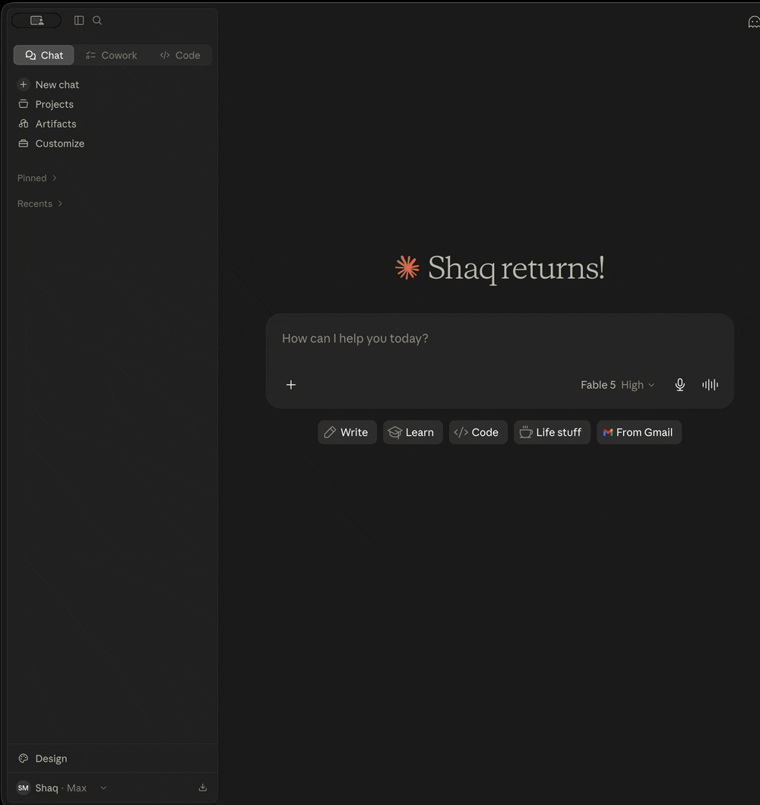
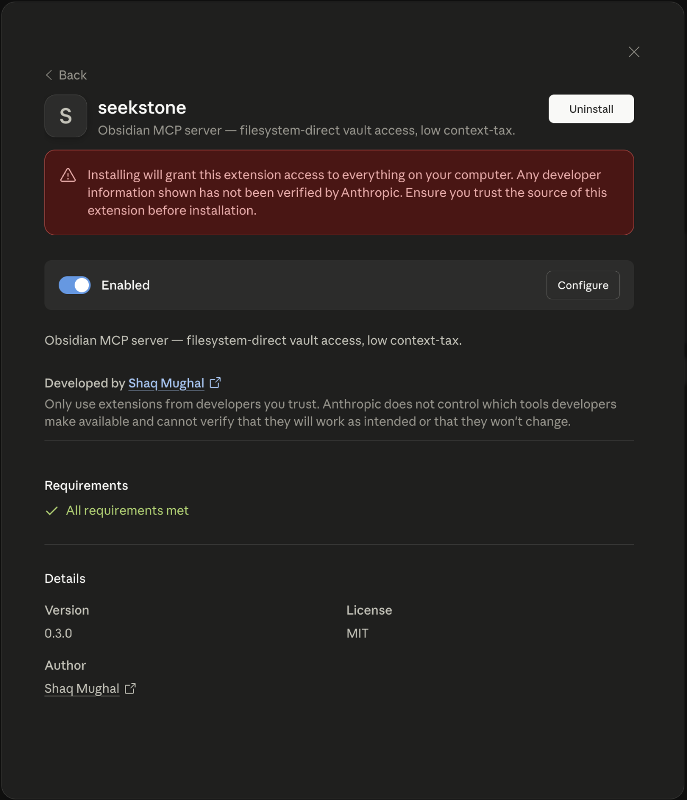

<p align="center">
  <picture>
    <source media="(prefers-color-scheme: dark)" srcset="brand/seekstone-wordmark-dark.svg" />
    
  </picture>
</p>

<p align="center"><strong>The Obsidian MCP server that needs no plugin, no running Obsidian app — and doesn't blow your context window.</strong></p>
<p align="center"><em>Filesystem-direct · single-digit-ms keyword search · ~14 ms semantic · ~2 KB payloads · 19 tools · macOS · Linux · Windows</em></p>

<p align="center"><a href="https://seekstone.dev"><strong>seekstone.dev →</strong></a></p>

<p align="center">
  <a href="https://github.com/shaqmughal/seekstone/releases/latest/download/seekstone.mcpb"></a>
  <a href="https://cursor.com/install-mcp?name=seekstone&amp;config=eyJjb21tYW5kIjoibnB4IiwiYXJncyI6WyIteSIsInNlZWtzdG9uZSJdLCJlbnYiOnsiU0VFS1NUT05FX1ZBVUxUIjoiL2Fic29sdXRlL3BhdGgvdG8veW91ci92YXVsdCJ9fQ%3D%3D"></a>
  <a href="https://vscode.dev/redirect?url=vscode:mcp/install?%7B%22name%22%3A%22seekstone%22%2C%22command%22%3A%22npx%22%2C%22args%22%3A%5B%22-y%22%2C%22seekstone%22%5D%2C%22env%22%3A%7B%22SEEKSTONE_VAULT%22%3A%22%2Fabsolute%2Fpath%2Fto%2Fyour%2Fvault%22%7D%7D"></a>
</p>

<p align="center">
  <a href="https://www.npmjs.com/package/seekstone"></a>
  <a href="https://www.npmjs.com/package/seekstone"></a>
  <a href="https://www.npmjs.com/package/seekstone"></a>
  <a href="https://codecov.io/gh/shaqmughal/seekstone"></a>
  <a href="https://app.codacy.com/gh/shaqmughal/seekstone/dashboard?utm_source=gh&utm_medium=referral&utm_content=&utm_campaign=Badge_grade"></a>
  <a href="https://socket.dev/npm/package/seekstone"></a>
  <a href="https://snyk.io/test/github/shaqmughal/seekstone"></a>
  <a href="https://github.com/shaqmughal/seekstone/actions/workflows/ci.yml"></a>
  <a href="https://scorecard.dev/viewer/?uri=github.com/shaqmughal/seekstone"></a>
  <a href="https://www.bestpractices.dev/projects/13166"></a>
  <a href="LICENSE"></a>
  
  <a href="https://glama.ai/mcp/servers/shaqmughal/seekstone"></a>
  <a href="https://x.com/seekstone"></a>
  <a href="https://bsky.app/profile/seekstone.bsky.social"></a>
  <a href="https://buymeacoffee.com/shaqmughal"></a>
</p>

---

|  | **Seekstone** | [obsidian-mcp-server](https://github.com/cyanheads/obsidian-mcp-server) (#1 by downloads) | REST-proxy servers |
|---|---|---|---|
| Local REST API plugin | **Not needed** | Required | Required |
| Obsidian app running | **Not needed — works with Obsidian closed** | Required | Required |
| Search payload @ 10k notes | **2.0 KB** | 47 KB | up to **95 MB** |
| Warm search latency @ 10k notes | **6.2 ms** | 732 ms (~118× slower) | up to 1,550 ms |
| Structured frontmatter queries | **Built-in (`query_notes`) — property/date/size predicates, answers in a few hundred bytes** | JSONLogic via REST | Varies |

<sup>Same queries, same committed vaults, 20 runs each, one machine — adapter captures span June–August 2026 snapshots (dates in each committed report) — [full results across eight servers and three vault sizes below](#why-seekstone-the-numbers), fully reproducible from the [harness](packages/harness).</sup>

---

<p align="center">
  
</p>

---

## What is Seekstone?

**Seekstone is an Obsidian MCP server** — it gives Claude (and any [Model Context Protocol](https://modelcontextprotocol.io) client) direct read and write access to your Obsidian vault. No Obsidian app needs to be open, no plugins are required, and nothing leaves your machine.

It reads your vault **directly from disk** rather than routing through the Obsidian Local REST API plugin, and holds a warm full-text index in-process. The practical difference is twofold:

- **Speed.** Keyword searches return in **single-digit milliseconds** warm and semantic searches in **~14 ms** — up to **~440× faster** than every other Obsidian MCP server we benchmarked, because there's no subprocess to spawn and no HTTP round-trip per query.
- **Context.** A broad search that returns **tens of megabytes** and millions of tokens via a REST-proxy server returns **~2 KB** via Seekstone — up to a **~47,000× reduction** that only widens as your vault grows.

Search comes in three modes: ranked **full-text search** (fuzzy and prefix matching), optional **local semantic search** (meaning-based, via a small on-device embedding model — opt-in, offline at runtime after a one-time ~30 MB model download), and **structured metadata queries** — `query_notes` filters by frontmatter properties (`status`, `due`, `type`, …), tags, folder, modified time, and size, answering questions like *"which draft notes changed this week?"* in a few hundred bytes instead of a search-and-read loop.

Claude can search and read your entire note library, in milliseconds, without burning most of its context window on a single tool call.

Published on npm as [`seekstone`](https://www.npmjs.com/package/seekstone) — install with `npx -y seekstone`. (Previously also published as `obsidian-mcp-seekstone`; that alias is deprecated but existing installs keep working.)

---

## Why Seekstone? The numbers.

Most Obsidian MCP servers return **full note content for every search hit**. On a broad query that's megabytes of text your LLM has to process — most of it irrelevant, all of it burning context window.

Seekstone returns short ranked excerpts instead (~120 characters by default, tunable per query). We benchmarked Seekstone against 7 other Obsidian MCP servers — 8 servers total — across **three vault sizes — 1,000 / 5,000 / 10,000 notes** (20 runs each). Every number below is [fully reproducible](packages/harness): the vaults are committed to this repo (generated from the public-domain 1911 Encyclopædia Britannica), so you can clone it and run the exact same benchmark yourself.

The point of testing three sizes is that **this is where the architectures diverge** — a real vault only grows.

**Search payload — bytes returned per query (context tax; lower is better)**

| Server | Architecture | 1k notes | 5k notes | 10k notes |
|---|---|---:|---:|---:|
| 🥇 **Seekstone** | in-process index | **1.6 KB** | **1.8 KB** | **2.0 KB** |
| [mcpvault](https://github.com/bitbonsai/mcpvault) | fs-direct subprocess | 1.7 KB | 1.9 KB | 2.2 KB |
| [obsidian-mcp-rs](https://www.npmjs.com/package/obsidian-mcp-rs) | fs-direct, per-query scan | 5.4 KB | 5.8 KB | 6.2 KB |
| [obsidian-tc](https://www.npmjs.com/package/obsidian-tc) | SQLite platform | 4.6 KB | 6.8 KB | 7.2 KB |
| [obsidian-mcp-server](https://github.com/cyanheads/obsidian-mcp-server) | REST API | 55 KB | 47 KB | 47 KB |
| [obsidian-mcp-pro](https://github.com/rps321321/obsidian-mcp-pro) | fs-direct subprocess | 25 KB | 84 KB | 114 KB |
| [obsidian-mcp](https://github.com/StevenStavrakis/obsidian-mcp) | fs-direct subprocess | 18 KB | 105 KB | 201 KB |
| [mcp-obsidian](https://github.com/MarkusPfundstein/mcp-obsidian) | REST API | 9.8 MB | 45 MB | **95 MB** |

Seekstone stays **flat (~2 KB)** no matter how big your vault gets, because it always returns ranked excerpts — and it's now the **smallest payload of every server tested**, edging out mcpvault at all three sizes. The REST-proxy servers return full note content for every match, so they grow with the vault — `mcp-obsidian` hits **95 MB** at 10k notes, and a single broad query (`the capital of`) averaged **370 MB / 97.8 million tokens** per call across 20 runs. At 10k notes that's a **~47,000× context-tax difference**.

**Search latency — warm mean, ms (lower is better)**

| Server | 1k notes | 5k notes | 10k notes | vs Seekstone @10k |
|---|---:|---:|---:|---|
| 🥇 **Seekstone** | **1.1** | **3.1** | **6.2** | **—** |
| obsidian-mcp-rs | 6.1 | 19 | 37 | ~6× slower |
| obsidian-mcp-pro | 46 | 213 | 430 | ~70× slower |
| obsidian-mcp-server | 82 | 356 | 732 | ~118× slower |
| obsidian-mcp | 82 | 405 | 811 | ~131× slower |
| mcpvault | 96 | 467 | 958 | ~155× slower |
| mcp-obsidian | 164 | 740 | 1,550 | ~250× slower |
| obsidian-tc | 264 | 1,302 | 2,714 | ~440× slower |

Every competitor spawns a subprocess or makes HTTP round-trips per query, and most do work that scales with vault size. Seekstone holds a warm in-process index — **no IPC, no network** — so keyword search stays in **single-digit milliseconds** even at 10,000 notes (semantic mode adds a flat ~8 ms of embedding-and-scan on top). And the gap **widens with scale**: from 1k → 10k notes the competitors slow down 5–10×, while Seekstone barely moves. Even the *fastest* alternative — [obsidian-mcp-rs](https://www.npmjs.com/package/obsidian-mcp-rs), which re-scans the vault on every query — is **~6× slower** warm at 10k notes with **3× the payload**, and the REST-proxy generation runs **~90–250× slower**.

**Seekstone is the only server in our benchmark set that delivers both ~2 KB payloads and single-digit-ms keyword latency at every vault size** — and, as far as we know, the only Obsidian MCP server with published, reproducible benchmarks. The harness, the synthetic vaults, and the full results are open source: see [`benchmark-scaling.md`](packages/harness/fixtures/baseline-reports/scaling/benchmark-scaling.md) and the [harness](packages/harness). Clone, run, verify.

---

## Install

Choose the method that suits you best.

### Using an AI agent? Paste this prompt

If you use Claude Code, Cursor, or another coding agent, you don't need to follow any instructions yourself — paste this prompt and the agent does the install:

> Install the **seekstone** MCP server for this editor. Run `npx -y seekstone init --client code --write` (use `desktop`, `cursor`, or `vscode` for other clients). It auto-detects my Obsidian vault; if it lists several, ask me which one and re-run with `--vault "<path>"`. Relay any errors to me, then tell me to restart this session so the seekstone tools load.

`seekstone init` is fully non-interactive — with `--write` it validates the vault and patches the client config in one shot (Claude Code via `claude mcp add`, other clients via an additive JSON patch with a timestamped backup).

### Option 1 — One-click (Claude Desktop, no terminal needed)

1. Download `seekstone.mcpb` from [GitHub Releases](https://github.com/shaqmughal/seekstone/releases/latest)
2. Open it with Claude Desktop — double-click in Finder, or right-click → Open With → Claude Desktop
3. Pick your Obsidian vault folder when prompted

You'll know it worked when seekstone appears in Claude's toolbar. No JSON editing, no terminal, no Node.js required.



### Option 2 — Guided setup (recommended for CLI users)

Open **Terminal** (macOS: `Cmd+Space`, type "Terminal", press Enter) and run:

```bash
npx -y seekstone init
```

You'll know it worked when Seekstone appears in Claude's toolbar under the plug icon.

Seekstone reads Obsidian's own vault registry to detect your vault, validates it, and either prints the config block to paste or patches Claude Desktop directly:

```bash
# Auto-detect vault, print config to paste
npx -y seekstone init

# Auto-detect vault, patch Claude Desktop in place (with backup)
npx -y seekstone init --write

# Specify vault explicitly if you have multiple
npx -y seekstone init --vault "/path/to/vault"

# Auto-configure Claude Code in one step (auto-detects vault, runs claude mcp add)
npx -y seekstone init --client code --write

# Or just print the Claude Code command without running it
npx -y seekstone init --client code
```

### Option 3 — Manual config (Claude Desktop)

Add to `claude_desktop_config.json` (Settings → Developer → Edit Config):

```json
{
  "mcpServers": {
    "seekstone": {
      "command": "npx",
      "args": ["-y", "seekstone"],
      "env": { "SEEKSTONE_VAULT": "/absolute/path/to/your/vault" }
    }
  }
}
```

### Option 4 — Claude Code

Auto-detects your vault and configures Claude Code in one command:

```bash
npx -y seekstone init --client code --write
```

Or manually, if you prefer to specify the vault path explicitly:

```bash
claude mcp add seekstone --env SEEKSTONE_VAULT=/absolute/path/to/your/vault -- npx -y seekstone
```

### Option 5 — Cursor

One-click: <a href="https://cursor.com/install-mcp?name=seekstone&amp;config=eyJjb21tYW5kIjoibnB4IiwiYXJncyI6WyIteSIsInNlZWtzdG9uZSJdLCJlbnYiOnsiU0VFS1NUT05FX1ZBVUxUIjoiL2Fic29sdXRlL3BhdGgvdG8veW91ci92YXVsdCJ9fQ%3D%3D"></a> — then set `SEEKSTONE_VAULT` to your vault's absolute path in Cursor's MCP settings (the link installs a placeholder).

Or let the CLI auto-detect your vault and patch `~/.cursor/mcp.json` (with a backup):

```bash
npx -y seekstone init --client cursor --write
```

Or add the block manually to `~/.cursor/mcp.json` (global) or `<project>/.cursor/mcp.json` (per-project):

```json
{
  "mcpServers": {
    "seekstone": {
      "command": "npx",
      "args": ["-y", "seekstone"],
      "env": { "SEEKSTONE_VAULT": "/absolute/path/to/your/vault" }
    }
  }
}
```

### Option 6 — VS Code

One-click: <a href="https://vscode.dev/redirect?url=vscode:mcp/install?%7B%22name%22%3A%22seekstone%22%2C%22command%22%3A%22npx%22%2C%22args%22%3A%5B%22-y%22%2C%22seekstone%22%5D%2C%22env%22%3A%7B%22SEEKSTONE_VAULT%22%3A%22%2Fabsolute%2Fpath%2Fto%2Fyour%2Fvault%22%7D%7D"></a> — then set `SEEKSTONE_VAULT` to your vault's absolute path when VS Code opens the server config (the link installs a placeholder).

Or let the CLI auto-detect your vault and write the workspace config (`.vscode/mcp.json` in the current directory):

```bash
npx -y seekstone init --client vscode --write
```

Or add it from the terminal:

```bash
code --add-mcp '{"name":"seekstone","command":"npx","args":["-y","seekstone"],"env":{"SEEKSTONE_VAULT":"/absolute/path/to/your/vault"}}'
```

Or add the block manually to `.vscode/mcp.json` (workspace) or via Command Palette → *MCP: Open User Configuration* (user-global). Note VS Code's two quirks: the top-level key is `servers` (not `mcpServers`), and `"type": "stdio"` is required:

```json
{
  "servers": {
    "seekstone": {
      "type": "stdio",
      "command": "npx",
      "args": ["-y", "seekstone"],
      "env": { "SEEKSTONE_VAULT": "/absolute/path/to/your/vault" }
    }
  }
}
```

Requires VS Code 1.102+; seekstone appears in Copilot Chat's **Agent mode** tools picker.

### Other MCP clients (Windsurf, Cline, …)

Seekstone is a standard MCP stdio server — any MCP client can run it. Use the same JSON block as above in your client's MCP config (`command: npx`, `args: ["-y", "seekstone"]`, env `SEEKSTONE_VAULT`).

---

After installing, restart the client. On startup Seekstone walks the vault, builds an in-memory full-text index (a few seconds for thousands of notes), and keeps it live as you edit. The 19 tools below are then available to Claude.

Requires [Node.js](https://nodejs.org) ≥ 22 for the CLI options. The one-click `.mcpb` bundle has no external requirements.

If Seekstone saves you context, consider [⭐ starring the repo](https://github.com/shaqmughal/seekstone) — it helps others find it.

---

## What can Claude do with your vault?

Once Seekstone is connected, you can ask Claude things like:

- **"Search my notes for everything about [topic] and give me a summary"** — uses `search`, returns ranked excerpts, not full files
- **"Find all notes tagged #project and list their titles"** — uses `list_notes` with a tag filter
- **"Read just the 'Decisions' section of my [project] note"** — uses `read_note` with a section selector, so only that slice enters context
- **"What links to my [topic] note, and what does it link out to?"** — uses `get_backlinks` and `get_links` to walk your graph
- **"Append today's standup notes to my daily note"** — uses `append_periodic_note`, resolving the daily-note path from your vault config (Obsidian doesn't need to be open)
- **"Fix every occurrence of the old project name in this note"** — uses `replace_in_note`, with a dry-run preview before it writes
- **"Add a summary section to the bottom of [note]"** — uses `append_note`, never touches frontmatter
- **"Move all notes in /inbox to /archive/[year]"** — uses `move_note`
- **"Update the status field in this note's frontmatter to 'done'"** — uses `patch_frontmatter`, preserves key order and quote style
- **"Create a new meeting note for today with a standard template"** — uses `create_note`

Claude never sees your full vault at once — it searches and reads selectively, so even large vaults (10k+ notes) stay within context budget.

---

## Tools

### Read

| Tool | Description |
|---|---|
| `search` | Full-text search. Returns ranked excerpts (default ~120 chars, tunable via `excerptLength`), not full notes. Fuzzy and prefix matching; with `SEEKSTONE_SEMANTIC=1`, `mode: "semantic"`/`"hybrid"` searches by meaning via a local embedding model (nothing leaves your machine). |
| `query_notes` | Structured metadata query. Filter by frontmatter key/value predicates (`eq`, `ne`, `contains`, `exists`, `missing`, `gt`/`gte`/`lt`/`lte`), tag, folder, modified time, and size; sort and select the fields you need. Returns compact rows (path + title by default), not note content. |
| `context_pack` | Answer-ready context for a natural-language question in one call, hard-capped at a byte budget (default 2 KB): ranked excerpts, linked neighbor notes with one-line summaries, and follow-up source paths — replaces a search → read → get_backlinks round-trip loop. |
| `read_note` | Read the full content of a note by vault-relative path. Supports returning a single section, block, or line range. |
| `list_notes` | List notes, optionally filtered by folder prefix or tag. |
| `list_tags` | List all tags in the vault sorted by usage count (or alphabetically). |
| `outline_note` | Return a note's heading and block structure without its full content — cheap navigation before a targeted read. |
| `get_backlinks` | Find all notes that link to a given note. |
| `get_links` | List all outgoing wikilinks and markdown links from a note. |
| `get_periodic_note` | Read today's (or any date's) daily, weekly, monthly, quarterly, or yearly note — path resolved from your vault config, no Obsidian required. |

### Write

| Tool | Description |
|---|---|
| `create_note` | Create a note (optional frontmatter + body); parent directories are created automatically. |
| `delete_note` | Move a note to the vault's `.trash/` folder (Obsidian-compatible, restorable). Pass `permanent: true` for an unrecoverable delete. |
| `move_note` | Move or rename a note — wikilinks and markdown links in other notes that point at it are rewritten so nothing breaks (`rewriteLinks: false` to opt out); destination directories are created automatically. |
| `rename_heading` | Rename a heading in a note — every `[[note#heading]]` wikilink and embed across the vault is rewritten so references keep working (aliases preserved, fenced code blocks left alone). |
| `append_note` | Append text to a note body without touching frontmatter. |
| `patch_frontmatter` | Set, update, or delete frontmatter keys without reordering existing keys or changing quote style. |
| `patch_note` | Append, prepend, or replace text at a heading or block reference (`createIfMissing` to add the section) — frontmatter untouched. |
| `replace_in_note` | Find and replace text in the note body — literal or regex, case sensitivity, whole-word matching, optional `limit` (replaces **all** occurrences by default), and a dry-run preview. |
| `append_periodic_note` | Append to today's periodic note, creating it from a template if it doesn't yet exist. |

Every write tool (`append_note`, `patch_note`, `patch_frontmatter`, `replace_in_note`, `rename_heading`, `move_note`, `delete_note`, `append_periodic_note`, and `create_note` with `overwrite: true`) supports optional **compare-and-swap**: pass the `contentHash` you got from `read_note` as `prevHash` and the call fails cleanly if the note changed underneath you — no silently discarded concurrent edit, no moving or deleting content you haven't seen. Every mutating result returns the new `contentHash`, so chained edits need no re-reads.

**Fast *and* complete.** Seekstone is the only Obsidian MCP server in our benchmark set to expose `list_tags`, `outline_note`, `get_backlinks`, and `get_links` as first-class tools. Four more capabilities set it apart:

- **Local semantic search, fully in-process.** With `SEEKSTONE_SEMANTIC=1`, `search` gains `mode: "semantic"` and `"hybrid"` — meaning-based retrieval through a small on-device embedding model (one-time `npx -y seekstone fetch-model` download; the running server never touches the network). On our committed 10k-note benchmark vault, description-style queries hit the right note in the top 5 **70% of the time vs 30% for keyword search** ([committed eval](packages/harness/fixtures/baseline-reports/retrieval-eval.md)). No other server we **benchmarked** ships offline, zero-native-dependency embeddings — and we measured the alternatives head-to-head on the same golden set — now expanded to 150 queries with a committed dev/holdout split ([committed comparison](packages/harness/fixtures/baseline-reports/retrieval-eval-competitors.md)): obsidian-tc's Ollama-backed semantic search is genuinely **more accurate** (89.3% vs our 76% overall hit@5 — its 137M-parameter model vs our 8M one), and it pays for it with **12× slower queries** (171 ms vs 14 ms p50), **~90× slower indexing** (38 min vs 24 s cold on this run; 26.5 min on the previous one), **~7× the payload** (15.6 KB vs ~2 KB per query), and a second server you must install and run. obsidian-mcp-pro could not index the 10k-note vault at all (its JSON vector store exceeds JavaScript's string limit after ~15 minutes of embedding). Pick your trade — the numbers are all committed.

- **Periodic notes, filesystem-direct.** `get_periodic_note` and `append_periodic_note` resolve daily, weekly, monthly, quarterly, and yearly note paths by reading your vault's own config (`.obsidian/daily-notes.json` and the Periodic Notes plugin) — **with Obsidian closed.** Every REST-based server can only do this while the app is running.
- **Byte-identical frontmatter, guaranteed.** `patch_frontmatter` edits YAML in place — preserving key order, quote style, and comments — and write-safety is proven byte-for-byte by the test harness. No other server we surveyed makes this guarantee.
- **Zero coupling.** No Obsidian app, no Local REST API plugin, no plugin-version drift. Just your files on disk.

---

## Configuration

| Variable | Required | Description |
|---|---|---|
| `SEEKSTONE_VAULT` | Yes | Absolute path to your Obsidian vault. |
| `SEEKSTONE_LOG_LEVEL` | No | `error` \| `warn` \| `info` (default) \| `debug`. |
| `SEEKSTONE_LOG_FILE` | No | Absolute path; when set, JSON-line logs are appended here (size-rotated). |
| `SEEKSTONE_LOG_MAX_SIZE` | No | Log-rotation threshold for `SEEKSTONE_LOG_FILE` (e.g. `10mb`; default 5 MB). |
| `SEEKSTONE_WATCH_POLL` | No | Set to `1` to stat-poll for changes instead of native OS events — slower but reliable on network drives, WSL, and some containers. |
| `SEEKSTONE_READ_ONLY` | No | Set to `1` to run read-only: the 9 write tools are unregistered from the tool list entirely (and rejected if called anyway), so the session provably cannot modify your vault. |
| `SEEKSTONE_WRITE_PATHS` | No | Comma-separated vault-relative globs (e.g. `journal/**,inbox/*.md`). Writes are permitted only under matching paths; the rest of the vault stays read-only. |
| `SEEKSTONE_SEMANTIC` | No | Set to `1` to enable semantic search (`search` gains `mode: "semantic"` and `"hybrid"`). Requires the local embedding model — download it once with `npx -y seekstone fetch-model`; the running server never touches the network. |
| `SEEKSTONE_MODEL_PATH` | No | Directory holding the Model2Vec embedding model (default: where `fetch-model` puts it, under the cache dir). |
| `SEEKSTONE_CACHE_DIR` | No | Cache root for the downloaded model and per-vault embedding caches (default `~/.cache/seekstone`). |

---

## How it works

Seekstone walks the vault with `fast-glob`, parses each note's frontmatter (byte-aware, so writes can prove the frontmatter region is byte-identical pre- and post-write), and builds a [MiniSearch](https://github.com/lucaong/minisearch) full-text index in memory. Search returns short ranked excerpts rather than whole notes — that excerpt-not-document design is where the context-tax win comes from. A cross-platform file watcher ([chokidar](https://github.com/paulmillr/chokidar)) keeps the index current as you edit in Obsidian.

Writes are conservative by design: `append_note` never touches frontmatter, and `patch_frontmatter` edits the YAML document in place rather than re-serializing it, preserving key order, quote style, and comments.

It's built to stay up. Seekstone is tested on macOS, Linux, and Windows in CI on every commit, its write tools are hardened against pathological (ReDoS) inputs, and a stray unhandled rejection is logged rather than crashed on — so your long-lived MCP session keeps its warm index instead of dropping out mid-conversation.

For a layer-by-layer tour of the codebase — packages, the server's internals, the end-to-end request flow, and the measurement harness — see [`docs/ARCHITECTURE.md`](docs/ARCHITECTURE.md).

---

## Security & privacy

Seekstone reads — and, via the write tools, modifies — files under `SEEKSTONE_VAULT` on your local disk. The running server makes **no network calls** and sends **no telemetry** (the one network path in the package is the explicit `npx -y seekstone fetch-model` subcommand — a SHA-256-verified, one-time download of the optional semantic-search model that exits before serving starts). Logs are metadata-only by default (note contents only appear at `debug` level). Nothing is written outside the vault except an optional log file you configure and, with `SEEKSTONE_SEMANTIC=1`, the per-vault embedding cache under `~/.cache/seekstone` (derived vectors of your notes — never sent anywhere).

### The Write-Safety Contract

Giving an AI write access to your notes deserves more than "trust us." Seekstone ships a named, tested contract — [`docs/WRITE-SAFETY.md`](docs/WRITE-SAFETY.md) — of **eight guarantees, each linked to the code that enforces it and the test that proves it**, verified byte-by-byte by the harness safety suite in CI on every commit and release: zero network, vault sandbox, byte-identical frontmatter on body edits, atomic writes (no torn files), creates never clobber, recoverable deletes (`.trash/`), optional compare-and-swap on every write tool, and configurable write scoping / read-only mode. The same suite runs headlessly against other FS-direct servers — the comparison table is in the contract.

---

## Frequently asked questions

**Does the Obsidian app need to be running?**
No. Seekstone reads the vault folder directly from disk. Obsidian can be open or closed.

**Do I need the Local REST API plugin?**
No. Seekstone bypasses it entirely — that's the source of the up-to-47,000× payload reduction. No plugins are required.

**Which AI clients does it support?**
Any client that supports the [Model Context Protocol](https://modelcontextprotocol.io) (MCP) over stdio — Claude Desktop, Claude Code, Cursor, Windsurf, Continue, and others.

**Is it safe to use on my vault?**
Seekstone never modifies files except when you explicitly invoke one of its write tools (the nine in the table above — `create_note`, `append_note`, `patch_note`, `patch_frontmatter`, `replace_in_note`, `move_note`, `rename_heading`, `delete_note`, `append_periodic_note`). The running server makes no network requests (semantic search's model is fetched once, out-of-band, by the explicit `fetch-model` subcommand). The vault path is sandboxed — no tool can read or write outside it. And you can tighten it further: `SEEKSTONE_READ_ONLY=1` removes the write tools from the session entirely, and `SEEKSTONE_WRITE_PATHS` restricts writes to the folders you allow (say, only `journal/**`). Both are enforced at the dispatch layer, not per-tool, so no tool can forget the check.

**Does it work on Windows?**
Yes. Seekstone is tested on macOS, Linux, and Windows in CI on every commit.

**What Obsidian vault sizes does it handle?**
Seekstone has been profiled against vaults with thousands of notes. On the committed 10,000-note benchmark vault, the cold index build takes tens of seconds and process RSS lands under ~100 MB; typical personal vaults index in a few seconds. Semantic mode embeds in the background after boot (~20 s at 10k notes, then cached per-vault so restarts reload in well under a second).

**How does `seekstone init` find my vault automatically?**
It reads Obsidian's own vault registry (`obsidian.json`) — the same file Obsidian uses to track your known vaults. If you have one vault, it's selected automatically. If you have multiple, it lists them and asks you to pick with `--vault`.

**What is the `.mcpb` file?**
An MCP Bundle — a self-contained zip with the server and its manifest. To install: double-click in Finder (or right-click → Open With → Claude Desktop), pick your vault, and you're done. No terminal or Node.js required.

---

## Contributing & development

Contributions welcome. See [CONTRIBUTING.md](CONTRIBUTING.md) for guidelines, or jump straight in:

```bash
npm install                                          # install all workspace deps
npm test                                             # run all tests
npm run lint                                         # biome check
npm run build -w seekstone                           # tsup → dist/
npm run build:mcpb                                   # build seekstone.mcpb bundle

npx vitest run packages/server/src/tools/search.test.ts  # single test file
npx vitest run -t 'parses a typical frontmatter'         # single test by name
npx tsc -p packages/server/tsconfig.json --noEmit        # typecheck
```

### Repository layout

| Package | Purpose |
|---|---|
| `packages/server` | The published `seekstone` MCP server (19 tools, stdio, MiniSearch index, chokidar watcher). |
| `packages/core` | Shared vault primitives — walk, frontmatter parser, link/tag extractor, outline, percentiles, pmap, and the Model2Vec embedder. Bundled into the server build. |
| `packages/harness` | Profiler + benchmark + write-safety harness (REST vs filesystem) that produced the payload numbers above. Dev-only; not published. |

The server has a real build (tsup → `dist/`) and is published to npm. The harness is run from source via `tsx`. Releases are automated — see [docs/RELEASING.md](docs/RELEASING.md).

### The measurement harness

The harness exists to reproduce the benchmark numbers that motivated the filesystem-direct design. The default reproduction path (`fs`/`seekstone` backends against the committed synthetic vault) needs nothing extra; only the REST-backed backends (`rest`, `mcp-obsidian`, `obsidian-mcp-server`) need Obsidian running with the Local REST API plugin.

```bash
export SEEKSTONE_VAULT="/absolute/path/to/your/vault"

npx tsx packages/harness/src/cli.ts profile --vault "$SEEKSTONE_VAULT"
npx tsx packages/harness/src/cli.ts bench \
  --queries packages/harness/queries/default.json \
  --stats reports/vault-stats.json
npx tsx packages/harness/src/cli.ts safety --vault "$SEEKSTONE_VAULT"
```

Harness env vars: `SEEKSTONE_REST_API_KEY` (from the Local REST API plugin) and `SEEKSTONE_REST_URL` (defaults to `https://127.0.0.1:27124`).

---

## Support

Seekstone is free and open source. If it saves you context (and money), you can [buy me a coffee](https://buymeacoffee.com/shaqmughal).

---

## License

MIT © Shaq Mughal
