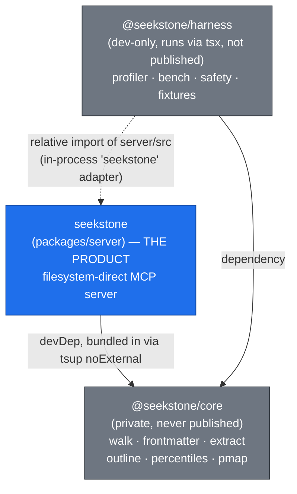
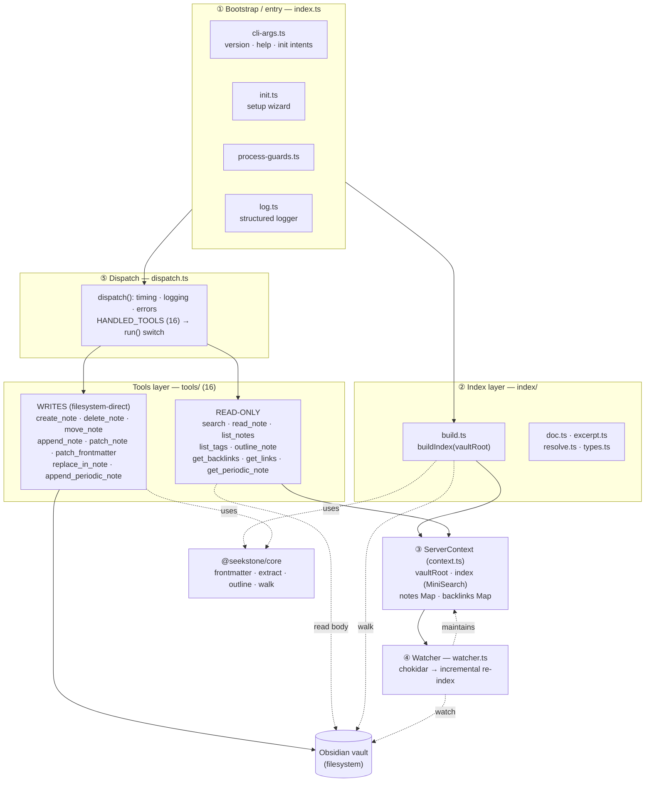
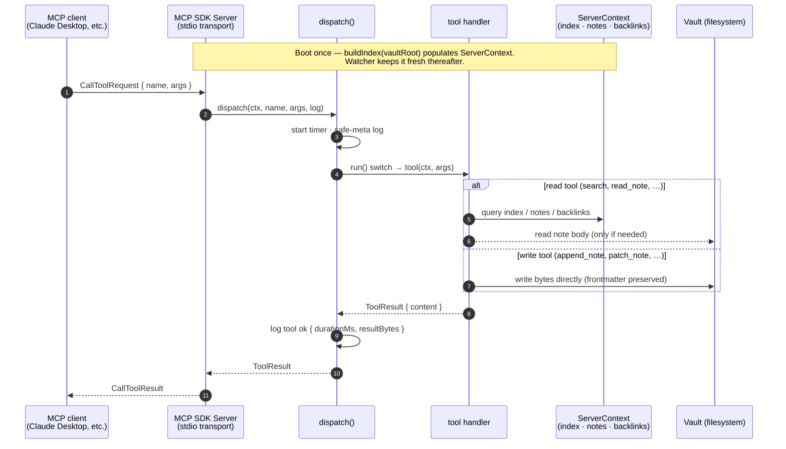
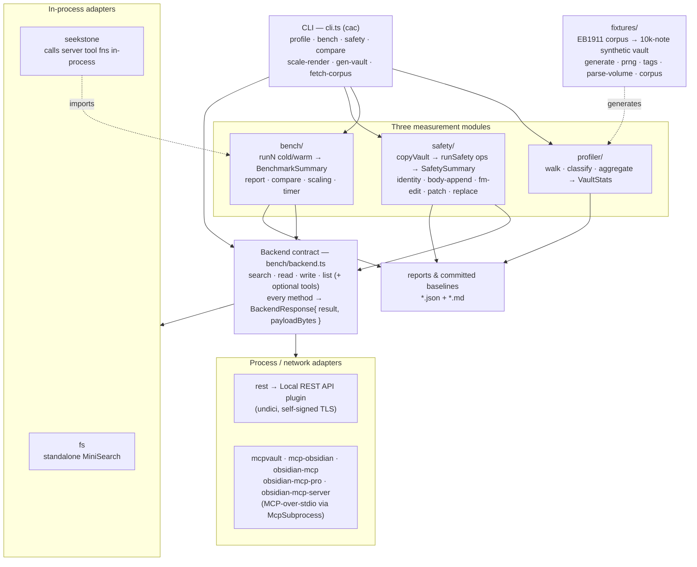
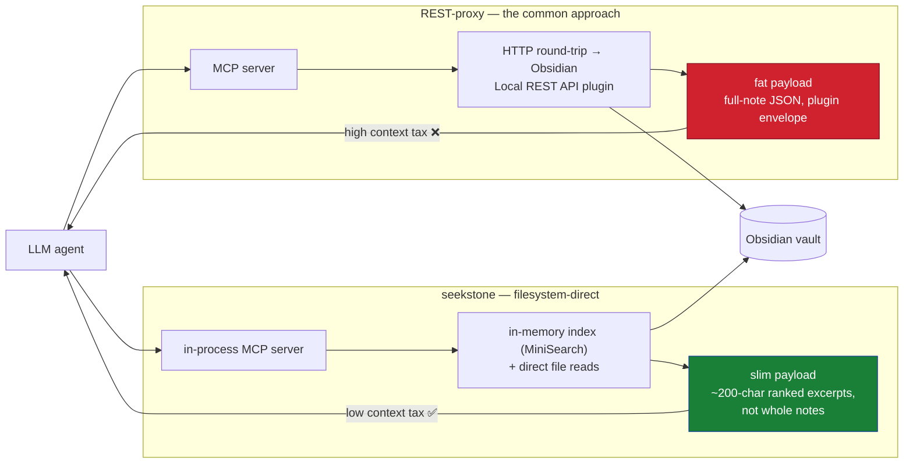

# Architecture

How seekstone is put together: the packages, the layers inside the MCP server,
how a request flows end-to-end, and how the measurement harness mirrors the
server's surface to produce the benchmark numbers.

> **Scope.** This is a snapshot of the code as it stands. The diagrams below are
> verified against `packages/*/src`. When you add a layer, a tool, or an adapter,
> update the matching diagram here — same "guard against drift" discipline the
> repo already applies to `server.json` and `docs/REGISTRIES.md`.

---

## 1. Workspace / package graph

seekstone is an npm workspace (`packages/*`) of three packages. Only one is
published to npm; the other two are a private primitives library and the
dev-only measurement harness. (A fourth package, the `obsidian-mcp-seekstone`
discovery alias, was published through 0.7.x and is now deprecated on npm.)

- **`@seekstone/core`** — pure, dependency-free primitives shared by the server
  and the harness. Exposed as subpath exports (`@seekstone/core/frontmatter`,
  `/extract`, `/outline`, `/walk`, `/percentiles`, `/pmap`). It is **private and
  never published**, so the server's build inlines it (see below).
- **`seekstone`** (`packages/server`) — the product. The only runtime npm
  dependencies are `@modelcontextprotocol/sdk`, `chokidar`, `fast-glob`,
  `minisearch`, `yaml`, and `zod`. `tsup` bundles `src/index.ts` **plus the
  `@seekstone/core` workspace package** into a single self-contained
  `dist/index.js` (ESM, `#!/usr/bin/env node` shebang); the npm deps stay
  external and install normally. This is why `@seekstone/core` is a *devDep*
  with `noExternal: [/^@seekstone\//]` in `tsup.config.ts`.
- **`@seekstone/harness`** — the measurement suite. Runs from source via `tsx`
  (no build step; `tsc` is typecheck-only). It depends on `@seekstone/core` and
  also imports `packages/server/src` **directly** to benchmark the server's own
  tool functions in-process (the `seekstone` adapter).

---

## 2. Server — layered architecture

Inside `packages/server/src`, the server is five layers. State lives in one
`ServerContext` object that the bootstrap builds once and the watcher keeps
fresh; every tool reads from it.

**Layer responsibilities**

1. **Bootstrap (`index.ts`)** — the executable entry. Handles `version` / `help`
   / `init` CLI intents (which print and exit before any server starts), then
   for an MCP session: requires `SEEKSTONE_VAULT`, installs process guards
   (a stray unhandled rejection must not kill a long-lived stdio session),
   builds the index, constructs the `ServerContext`, starts the watcher, and
   wires the `@modelcontextprotocol/sdk` `Server` to a `StdioServerTransport`
   with `ListTools` + `CallTool` handlers.
2. **Index layer (`index/`)** — `buildIndex(vaultRoot)` walks the vault, parses
   each note, and returns a `MiniSearch` full-text index, a `notes` map
   (path → `IndexedNote`), and a `backlinks` reverse-link map. This is the
   in-memory model every read tool queries.
3. **`ServerContext` (`context.ts`)** — the single shared state bag:
   `{ vaultRoot, index, notes, backlinks }`. No globals; it's threaded into every
   tool call.
4. **Watcher (`watcher.ts`)** — chokidar watches the vault and incrementally
   updates `index` / `notes` / `backlinks` so the in-memory model never goes
   stale during a session.
5. **Dispatch (`dispatch.ts`)** — the routing seam. `dispatch()` wraps the
   per-tool `run()` switch with `performance.now()` timing, structured logging
   (content/query args are debug-only — never logged at info), payload-byte
   measurement, and uniform error-to-`isError` handling. `HANDLED_TOOLS` is the
   16-name source of truth, kept in sync with the `ListTools` schema.

The **tools** themselves are thin: read tools answer from `ServerContext`
(and read note bodies straight off disk when needed); write tools mutate the
vault filesystem directly, using `@seekstone/core` to preserve frontmatter
byte-for-byte.

---

## 3. Request flow (a `tools/call`)

`ListToolsRequest` is answered directly from the bootstrap's static schema list
(the 16 tools). On error, `dispatch()` catches and returns
`{ isError: true, content: [...] }` rather than throwing — the session stays
alive.

---

## 4. Harness — measurement architecture

The harness is three modules behind one CLI, all speaking the same `Backend`
contract — the same `search / read / write / list` surface the server exposes.
That symmetry is deliberate: it lets every competing Obsidian-MCP approach be
measured against seekstone on equal footing, with **payload bytes captured at
the boundary** as the headline "context tax" metric.

- **`Backend` contract** (`bench/backend.ts`) — intentionally tiny:
  `search`, `read`, `write`, `list`, plus optional extended tools
  (`listTags`, `outline`, `getBacklinks`, `getLinks`, `getPeriodicNote`,
  `searchStream`, `close`). Every call returns
  `BackendResponse<T> = { result, payloadBytes, payloadText? }`, so the raw
  bytes a backend served are recorded at the boundary.
- **Adapters** split into **in-process** (`fs`, `seekstone` — zero IPC, the most
  honest measure of seekstone's own algorithms) and **process/network**
  (`rest` over undici; the MCP-over-stdio family sharing one `McpSubprocess`
  transport helper).
- **profiler** walks a vault and aggregates a content-shape `VaultStats`.
- **bench** runs each measurement N times, splitting **cold** (run 1) from
  **warm** (runs 2..N) so a cheap warm number can't hide a brutal cold start,
  and renders per-adapter + cross-adapter (`compare`) + multi-scale (`scaling`)
  reports.
- **safety** copies the vault to a scratch dir and round-trips write ops,
  proving frontmatter stays byte-identical.
- **fixtures** generate the committed, personal-data-free 10k-note synthetic
  vault from the public-domain 1911 Encyclopædia Britannica (deterministic,
  seed 42 — hence the custom `prng`, since `Math.random()` is banned harness-wide).

---

## 5. The thesis: filesystem-direct vs REST-proxy

The whole project exists to demonstrate one claim: **filesystem-direct beats the
REST-proxy approach, and the win is mostly payload size ("context tax"), not raw
CPU.** This is the shape the harness measures.

seekstone needs **no running Obsidian instance and no plugin** — it reads the
vault directly and returns only what the agent needs. The REST-proxy path
requires Obsidian open with the Local REST API plugin, and tends to return
whole-note payloads through an HTTP envelope. The harness quantifies the gap;
the committed baseline reports under
[`packages/harness/fixtures/baseline-reports/`](../packages/harness/fixtures/baseline-reports)
are the receipts.

---

## The 16 tools

| Tool | Kind | Purpose |
| --- | --- | --- |
| `search` | read | Ranked full-text search; returns ~200-char excerpts, not full notes |
| `read_note` | read | Read a note (with optional outline/frontmatter metadata) |
| `list_notes` | read | Enumerate notes, optionally by folder |
| `list_tags` | read | All tags with usage counts |
| `outline_note` | read | Heading tree + block anchors, no body |
| `get_backlinks` | read | Reverse-link lookup for a note |
| `get_links` | read | Outgoing wikilinks/embeds of a note |
| `get_periodic_note` | read | Resolve today's / a given date's periodic note |
| `create_note` | write | Create a new note |
| `delete_note` | write | Delete a note |
| `move_note` | write | Move/rename a note |
| `append_note` | write | Append to a note body |
| `patch_note` | write | Targeted body edit by heading/block |
| `patch_frontmatter` | write | Edit frontmatter, preserving key order/comments |
| `replace_in_note` | write | Find/replace within a note |
| `append_periodic_note` | write | Append to today's / a given date's periodic note |

The list is mirrored in `dispatch.ts` (`HANDLED_TOOLS`) and the `ListTools`
schema in `index.ts`; `docs/REGISTRIES.md` carries the same count and a CI guard
keeps them in sync.
