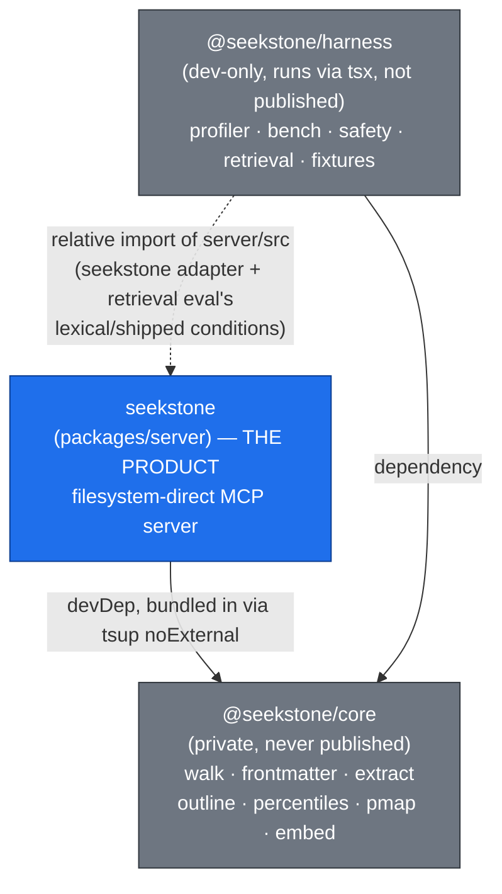
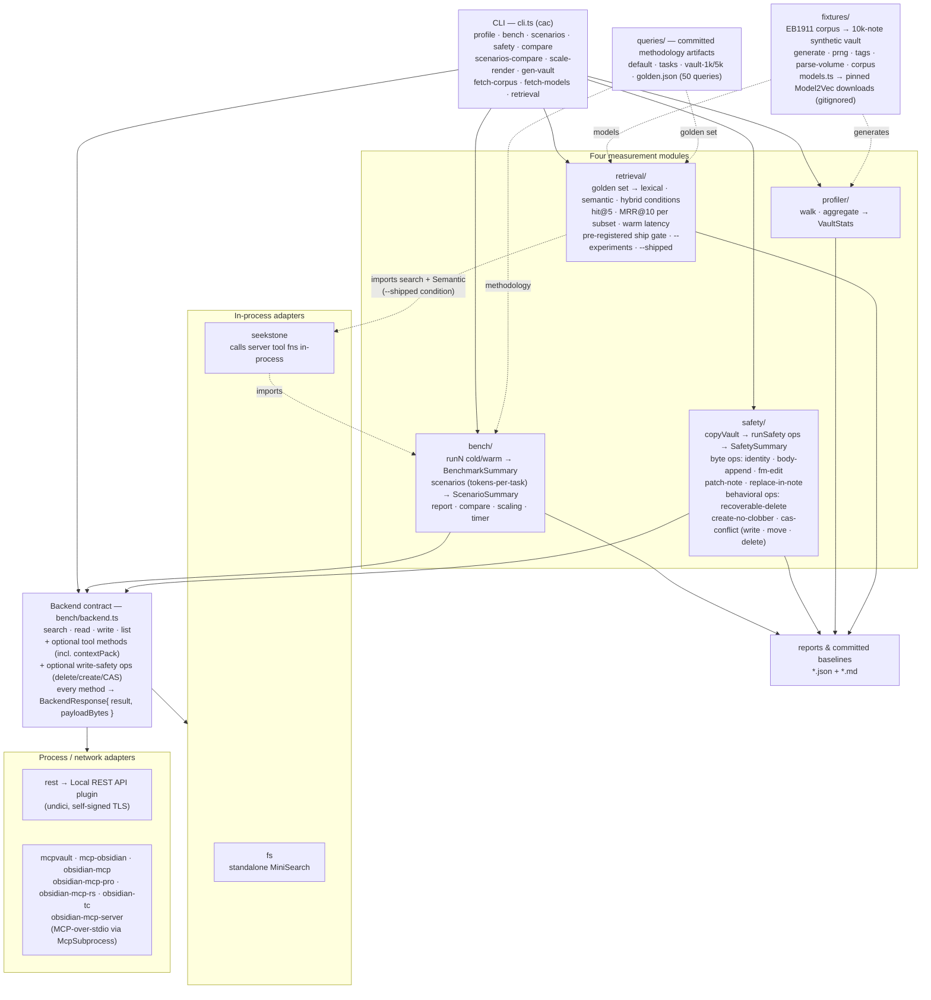
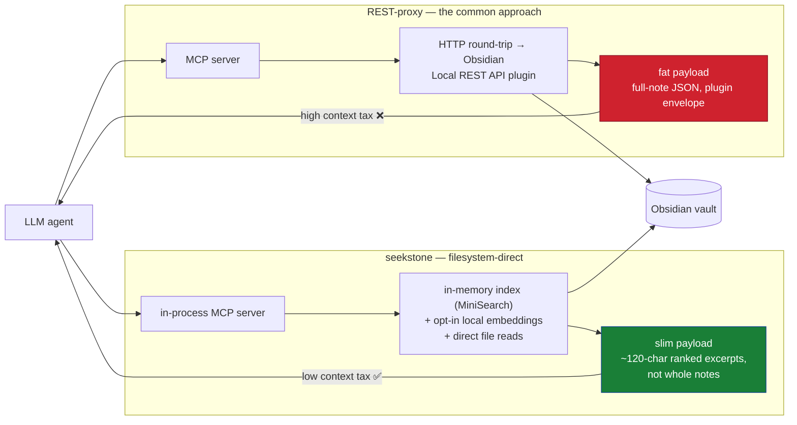

# Architecture

How seekstone is put together: the packages, the layers inside the MCP server,
how a request flows end-to-end, and how the measurement harness mirrors the
server's surface to produce the benchmark numbers.

> **Scope.** This is a snapshot of the code as it stands. The diagrams below are
> verified against `packages/*/src`. When you add a layer, a tool, or an adapter,
> update the matching diagram here — same "guard against drift" discipline the
> repo already applies to `server.json` and `docs/REGISTRIES.md`.

---

## 1. Workspace / package graph

seekstone is an npm workspace (`packages/*`) of three packages. Only one is
published to npm; the other two are a private primitives library and the
dev-only measurement harness. (A fourth package, the `obsidian-mcp-seekstone`
discovery alias, was published through 0.7.x and is now deprecated on npm.)

```mermaid
flowchart TD
    core["@seekstone/core<br/>(private, never published)<br/>walk · frontmatter · extract<br/>outline · percentiles · pmap · embed"]
    server["seekstone<br/>(packages/server) — THE PRODUCT<br/>filesystem-direct MCP server"]
    harness["@seekstone/harness<br/>(dev-only, runs via tsx, not published)<br/>profiler · bench · safety · retrieval · fixtures"]

    server -->|"devDep, bundled in via tsup noExternal"| core
    harness -->|"dependency"| core
    harness -.->|"relative import of server/src<br/>(seekstone adapter + retrieval eval's<br/>lexical/shipped conditions)"| server

    classDef product fill:#1f6feb,stroke:#0b3d91,color:#fff;
    classDef dev fill:#6e7681,stroke:#30363d,color:#fff;
    class server product;
    class harness,core dev;
```

- **`@seekstone/core`** — small, pure primitives shared by the server and the
  harness (its only deps are `fast-glob` and `yaml`; the `embed` module — a
  zero-dependency Model2Vec embedder — adds none). Exposed as subpath exports
  (`@seekstone/core/frontmatter`, `/extract`, `/outline`, `/walk`,
  `/percentiles`, `/pmap`, `/embed`). It is **private and never published**, so
  the server's build inlines it (see below).
- **`seekstone`** (`packages/server`) — the product. The only runtime npm
  dependencies are `@modelcontextprotocol/sdk`, `chokidar`, `fast-glob`,
  `minisearch`, `picomatch`, `yaml`, and `zod`. `tsup` bundles `src/index.ts` **plus the
  `@seekstone/core` workspace package** into a single self-contained
  `dist/index.js` (ESM, `#!/usr/bin/env node` shebang); the npm deps stay
  external and install normally. This is why `@seekstone/core` is a *devDep*
  with `noExternal: [/^@seekstone\//]` in `tsup.config.ts`.
- **`@seekstone/harness`** — the measurement suite. Runs from source via `tsx`
  (no build step; `tsc` is typecheck-only). It depends on `@seekstone/core` and
  also imports `packages/server/src` **directly** — the `seekstone` adapter
  benchmarks the server's tool functions in-process, and the retrieval eval's
  `--shipped` mode runs golden-set queries through the real `search` tool with
  `mode: semantic|hybrid` against the real per-vault embedding cache.

---

## 2. Server — layered architecture

Inside `packages/server/src`, the server is five layers (plus the opt-in
semantic index, 4b). State lives in one
`ServerContext` object that the bootstrap builds once and the watcher keeps
fresh; every tool reads from it.

```mermaid
flowchart TD
    subgraph boot["① Bootstrap / entry — index.ts"]
        cliargs["cli-args.ts<br/>version · help · init · init-help<br/>fetch-model intents"]
        init["init.ts<br/>setup wizard"]
        fetchm["semantic/fetch-model.ts<br/>pinned sha256 model download<br/>(CLI-only; exits before serving)"]
        guards["process-guards.ts"]
        log["log.ts<br/>structured logger<br/>SEEKSTONE_LOG_LEVEL · SEEKSTONE_LOG_FILE<br/>SEEKSTONE_LOG_MAX_SIZE"]
        pol["policy.ts<br/>parseWritePolicy: SEEKSTONE_READ_ONLY<br/>SEEKSTONE_WRITE_PATHS globs"]
        tl["tool-list.ts<br/>ALL_TOOLS schemas · visibleTools(policy)"]
    end

    subgraph idx["② Index layer — index/"]
        build["build.ts<br/>buildIndex(vaultRoot)"]
        doc["doc.ts · excerpt.ts · resolve.ts<br/>backlinks.ts · types.ts"]
    end

    ctx["③ ServerContext (context.ts)<br/>vaultRoot · index (MiniSearch)<br/>notes Map · backlinks Map · policy · semantic?"]

    watch["④ Watcher — watcher.ts<br/>chokidar → incremental re-index<br/>(SEEKSTONE_WATCH_POLL=1 to stat-poll,<br/>SEEKSTONE_WATCH_POLL_INTERVAL ms, default 10s)"]

    sem["④b Semantic index — semantic/ (opt-in, SEEKSTONE_SEMANTIC=1)<br/>state.ts lifecycle (background build · debounced re-embeds)<br/>store.ts per-note chunk vectors · route.ts hybrid routing<br/>config.ts (SEEKSTONE_MODEL_PATH · SEEKSTONE_CACHE_DIR) · excerpt.ts"]
    embcache[("Embedding cache<br/>~/.cache/seekstone (or SEEKSTONE_CACHE_DIR)<br/>vectors + chunk spans, keyed by (path, contentHash)")]

    subgraph disp["⑤ Dispatch — dispatch.ts"]
        dispatcher["dispatch(): timing · logging · errors<br/>read-only / write-policy gate (WRITE_TOOLS)<br/>HANDLED_TOOLS (19) → run() switch"]
    end

    subgraph tools["Tools layer — tools/ (19)"]
        reads["READ-ONLY<br/>search · query_notes · context_pack<br/>read_note · list_notes · list_tags<br/>outline_note · get_backlinks · get_links<br/>get_periodic_note"]
        writes["WRITES (filesystem-direct)<br/>create_note · delete_note · move_note<br/>rename_heading · append_note · patch_note<br/>patch_frontmatter · replace_in_note<br/>append_periodic_note"]
    end

    prims["Write primitives (shared by every write tool)<br/>vault-path.ts resolveVaultPath · policy.ts assertWritable<br/>atomic-write.ts (temp-file+rename) · content-hash.ts (CAS)<br/>tools/rewrite_links.ts (link-aware moves)"]

    vault[("Obsidian vault<br/>(filesystem)")]
    core2["@seekstone/core<br/>frontmatter · extract · outline · walk · embed"]

    boot --> build
    build --> ctx
    build -. uses .-> core2
    ctx --> watch
    watch -. maintains .-> ctx
    boot --> sem
    sem -. serves ctx.semantic .-> ctx
    watch -. noteChanged/noteRemoved .-> sem
    reads -. "mode: semantic / hybrid" .-> sem
    sem -. persists .-> embcache
    sem -. embed via .-> core2
    boot --> dispatcher
    dispatcher --> reads
    dispatcher --> writes
    reads --> ctx
    writes --> prims
    prims --> vault
    writes -. uses .-> core2
    reads -. read body .-> vault
    build -. walk .-> vault
    watch -. watch .-> vault
```

**Layer responsibilities**

1. **Bootstrap (`index.ts`)** — the executable entry. Handles `version` / `help`
   / `init` / `fetch-model` CLI intents (which print and exit before any server
   starts), then for an MCP session: installs process guards first (a stray
   unhandled rejection must not kill a long-lived stdio session), requires
   `SEEKSTONE_VAULT`, parses the write policy (`policy.ts` —
   `SEEKSTONE_READ_ONLY`, `SEEKSTONE_WRITE_PATHS`), builds the index,
   constructs the `ServerContext`, optionally starts the semantic index
   (`SEEKSTONE_SEMANTIC=1` — a missing/broken model is a **hard boot failure**
   with an actionable message, since the user opted in explicitly), starts the
   watcher, and wires the `@modelcontextprotocol/sdk` `Server` to a
   `StdioServerTransport` with `ListTools` + `CallTool` handlers. `ListTools`
   answers from `tool-list.ts` (`visibleTools(policy)` — in read-only mode the
   9 write tools are unregistered entirely, not just rejected).
2. **Index layer (`index/`)** — `buildIndex(vaultRoot)` walks the vault, parses
   each note, and returns a `MiniSearch` full-text index, a `notes` map
   (path → `IndexedNote`), and a `backlinks` reverse-link map. This is the
   in-memory model every read tool queries.
3. **`ServerContext` (`context.ts`)** — the single shared state bag:
   `{ vaultRoot, index, notes, backlinks, policy, semantic? }`. No globals;
   it's threaded into every tool call.
4. **Watcher (`watcher.ts`)** — chokidar watches the vault and incrementally
   updates `index` / `notes` / `backlinks` so the in-memory model never goes
   stale during a session; when semantic search is enabled it also pokes the
   semantic index's debounced re-embed queue.
   4b. **Semantic index (`semantic/`, opt-in)** — a local Model2Vec embedder
   (`@seekstone/core/embed`; model fetched out-of-band by `seekstone
   fetch-model` into `<cache>/models/potion-base-8M`, overridable via
   `SEEKSTONE_MODEL_PATH` — never fetched by the running server) plus a
   per-note chunk-vector store. Built in the background at boot (queries
   meanwhile get a structured `semantic_building` progress error); persisted
   to a per-vault `(path, contentHash)`-keyed cache of vectors + chunk spans
   under `SEEKSTONE_CACHE_DIR` (default `~/.cache/seekstone`) so restarts
   reload in milliseconds instead of re-embedding. Retrieval is a deliberate
   **brute-force cosine scan** (no ANN index — exhaustive over every chunk,
   ~14 ms warm at 10k notes) with max-pooling per note; the winning chunk's
   recorded span makes the excerpt a direct slice of the matching passage.
   `search`'s `mode: semantic` scans it; `mode: hybrid` routes exact-title
   lookups to lexical and everything else here.
5. **Dispatch (`dispatch.ts`)** — the routing seam. `dispatch()` wraps the
   per-tool `run()` switch with `performance.now()` timing, structured logging
   (content/query args are debug-only — never logged at info), payload-byte
   measurement, and uniform error-to-`isError` handling — tools signal typed
   failures by throwing JSON envelopes (`hash_conflict`,
   `semantic_unavailable`, `semantic_building` with progress) that dispatch
   passes through as the error text. It is also the write
   **policy enforcement seam**: calls to any of the 9 `WRITE_TOOLS` are rejected
   in read-only mode, and `get_periodic_note`'s `createIfMissing` side effect is
   neutralized there too. `HANDLED_TOOLS` is the 19-name source of truth, kept
   in sync with the `ListTools` schemas in `tool-list.ts`.

The **tools** themselves are thin: read tools answer from `ServerContext`
(and read note bodies straight off disk when needed — semantic hits never do;
their excerpts slice the in-memory body); write tools mutate the vault
filesystem through a shared set of write primitives — path containment
(`vault-path.ts`), a second per-handler `assertWritable` policy check
(`policy.ts`), optional compare-and-swap via `prevHash` on **every** write
tool including moves and deletes, with every mutating result returning a
`contentHash` (`content-hash.ts`), and a crash-safe temp-file+rename write
(`atomic-write.ts`) — using
`@seekstone/core` to preserve frontmatter byte-for-byte. `delete_note` moves
notes to the vault's `.trash/` folder rather than unlinking (unless
`permanent: true`), and `move_note` and `rename_heading` rewrite inbound
references via `tools/rewrite_links.ts` (link targets on moves, `#heading`
fragments on renames).

---

## 3. Request flow (a `tools/call`)

```mermaid
sequenceDiagram
    autonumber
    participant Client as MCP client<br/>(Claude Desktop, etc.)
    participant SDK as MCP SDK Server<br/>(stdio transport)
    participant D as dispatch()
    participant T as tool handler
    participant Ctx as ServerContext<br/>(index · notes · backlinks)
    participant Sem as Semantic index<br/>(embedder · chunk vectors, opt-in)
    participant FS as Vault (filesystem)

    Note over SDK,Ctx: Boot once — buildIndex(vaultRoot) populates ServerContext.<br/>With SEEKSTONE_SEMANTIC=1 the semantic index builds in the BACKGROUND<br/>(warm cache loads in ms; queries during the build get a progress error).<br/>Watcher keeps both fresh thereafter.

    Client->>SDK: CallToolRequest { name, args }
    SDK->>D: dispatch(ctx, name, args, log)
    D->>D: start timer · safe-meta log
    D->>T: run() switch → tool(ctx, args)
    alt read tool (search, read_note, …)
        T->>Ctx: query index / notes / backlinks
        T-->>FS: read note body (only if needed)
        opt search mode: semantic / hybrid
            T->>Sem: embedQuery → topNotes (cosine scan)<br/>excerpt = matching chunk's span
            Note right of Sem: not enabled / still building →<br/>structured semantic_unavailable /<br/>semantic_building error
        end
    else write tool (append_note, patch_note, …)
        D->>D: policy gate (read-only → reject)
        T->>T: resolveVaultPath · assertWritable<br/>prevHash CAS check (if given)
        T->>FS: atomic temp-file + rename<br/>(frontmatter preserved)
    end
    T-->>D: ToolResult { content }
    D->>D: log tool ok { durationMs, resultBytes }
    D-->>SDK: ToolResult
    SDK-->>Client: CallToolResult
```

`ListToolsRequest` is answered from `tool-list.ts` (`visibleTools(ctx.policy)`)
— all 19 tools normally, only the 10 read tools in read-only mode. On error,
`dispatch()` catches and returns `{ isError: true, content: [...] }` rather
than throwing — the session stays alive. Typed failures arrive as JSON in the
error text: `hash_conflict` (stale `prevHash`), `semantic_unavailable`
(semantic mode requested but not enabled), `semantic_building`
(index still embedding; includes done/total progress).

---

## 4. Harness — measurement architecture

The harness is four modules behind one CLI. Profiler, bench, and safety all
speak the same `Backend` contract — the same `search / read / write / list`
surface the server exposes. That symmetry is deliberate: it lets every
competing Obsidian-MCP approach be measured against seekstone on equal
footing, with **payload bytes captured at the boundary** as the headline
"context tax" metric. The fourth module, the **retrieval eval**, deliberately
bypasses `Backend` and calls server internals directly — it measures ranking
quality (hit@5 / MRR@10 against a committed golden query set), not payload.

```mermaid
flowchart TD
    cli["CLI — cli.ts (cac)<br/>profile · bench · scenarios · safety · compare<br/>scenarios-compare · scale-render · gen-vault<br/>fetch-corpus · fetch-models · retrieval"]

    backend["Backend contract — bench/backend.ts<br/>search · read · write · list<br/>+ optional tool methods (incl. contextPack)<br/>+ optional write-safety ops (delete/create/CAS)<br/>every method → BackendResponse{ result, payloadBytes }"]

    subgraph inproc["In-process adapters"]
        fs["fs<br/>standalone MiniSearch"]
        seek["seekstone<br/>calls server tool fns in-process"]
    end
    subgraph extern["Process / network adapters"]
        rest["rest → Local REST API plugin<br/>(undici, self-signed TLS)"]
        mcp["mcpvault · mcp-obsidian · obsidian-mcp<br/>obsidian-mcp-pro · obsidian-mcp-rs · obsidian-tc<br/>obsidian-mcp-server<br/>(MCP-over-stdio via McpSubprocess)"]
    end

    subgraph modules["Four measurement modules"]
        profiler["profiler/<br/>walk · aggregate → VaultStats"]
        bench["bench/<br/>runN cold/warm → BenchmarkSummary<br/>scenarios (tokens-per-task) → ScenarioSummary<br/>report · compare · scaling · timer"]
        safety["safety/<br/>copyVault → runSafety ops → SafetySummary<br/>byte ops: identity · body-append · fm-edit<br/>patch-note · replace-in-note<br/>behavioral ops: recoverable-delete<br/>create-no-clobber · cas-conflict (write · move · delete)"]
        retrieval["retrieval/<br/>golden set → lexical · semantic · hybrid conditions<br/>hit@5 · MRR@10 per subset · warm latency<br/>pre-registered ship gate · --experiments · --shipped"]
    end

    fixtures["fixtures/<br/>EB1911 corpus → 10k-note synthetic vault<br/>generate · prng · tags · parse-volume · corpus<br/>models.ts → pinned Model2Vec downloads (gitignored)"]
    queries["queries/ — committed methodology artifacts<br/>default · tasks · vault-1k/5k · golden.json (50 queries)"]
    reports["reports & committed baselines<br/>*.json + *.md"]

    cli --> profiler
    cli --> bench
    cli --> safety
    cli --> retrieval
    cli --> backend
    backend --> inproc
    backend --> extern
    bench --> backend
    safety --> backend
    bench --> reports
    safety --> reports
    profiler --> reports
    retrieval --> reports
    fixtures -. generates .-> profiler
    fixtures -. models .-> retrieval
    queries -. methodology .-> bench
    queries -. golden set .-> retrieval
    retrieval -. "imports search + Semantic<br/>(--shipped condition)" .-> seek
    seek -. imports .-> bench
```

- **`Backend` contract** (`bench/backend.ts`) — a tiny required core:
  `search`, `read`, `write`, `list`, plus optional extended tools
  (`listTags`, `contextPack`, `outline`, `getBacklinks`, `getLinks`,
  `getPeriodicNote`, `searchStream`, `close`) and optional write-safety
  methods (`deleteNote`, `createNote`, `readWithHash`, `casWrite`, `casMove`,
  `casDelete` — declaring one claims the guard) that drive the behavioral
  safety matrix. Every call returns
  `BackendResponse<T> = { result, payloadBytes, payloadText? }`, so the raw
  bytes a backend served are recorded at the boundary.
- **Adapters** split into **in-process** (`fs`, `seekstone` — zero IPC, the most
  honest measure of seekstone's own algorithms) and **process/network**
  (`rest` over undici; the MCP-over-stdio family sharing one `McpSubprocess`
  transport helper).
- **profiler** walks a vault and aggregates a content-shape `VaultStats`.
- **bench** runs each measurement N times, splitting **cold** (run 1) from
  **warm** (runs 2..N) so a cheap warm number can't hide a brutal cold start,
  and renders per-adapter + cross-adapter (`compare`) + multi-scale (`scaling`)
  reports.
- **safety** copies the vault to a scratch dir and runs eight op kinds: five
  byte-faithful round-trips (proving frontmatter stays byte-identical) plus
  three behavioral ops proving recoverable deletes, no-clobber creates, and
  compare-and-swap conflict detection — the `cas-conflict` op probes all three
  CAS guards (stale-hash write, move, and delete must each be refused).
- **retrieval** scores retrieval *quality* against `queries/golden.json`
  (50 hand-authored queries: 30 description-style semantic, 10 exact-term
  lexical controls, 10 topical; drift-guarded in CI) and computes the
  pre-registered SHA-257 ship gate in code: hybrid must gain ≥ +10 pts hit@5
  on the semantic subset, regress ≤ 2 pts on the lexical subset, and warm
  semantic p95 must stay ≤ 15 ms at 10k notes. `--experiments` adds the
  fusion candidates that lost the recipe bake-off (RRF, weighted-sum,
  top2mean pooling — reported, never gated); `--shipped` reruns every query
  through the server's real `search` tool and the real per-vault embedding
  cache (note: the one harness path that writes outside the repo, honoring
  `SEEKSTONE_CACHE_DIR`). The committed baseline is
  `fixtures/baseline-reports/retrieval-eval.{json,md}`, produced with
  `--model potion-base-8M --shipped`.
- **fixtures** generate the committed, personal-data-free 10k-note synthetic
  vault from the public-domain 1911 Encyclopædia Britannica (deterministic,
  seed 42 — hence the custom `prng`, since `Math.random()` is banned harness-wide).

---

## 5. The thesis: filesystem-direct vs REST-proxy

The whole project exists to demonstrate one claim: **filesystem-direct beats the
REST-proxy approach, and the win is mostly payload size ("context tax"), not raw
CPU.** This is the shape the harness measures.

```mermaid
flowchart LR
    agent["LLM agent"]

    subgraph seekpath["seekstone — filesystem-direct"]
        direction TB
        s1["in-process MCP server"]
        s2["in-memory index (MiniSearch)<br/>+ opt-in local embeddings<br/>+ direct file reads"]
        s3["slim payload<br/>~120-char ranked excerpts,<br/>not whole notes"]
        s1 --> s2 --> s3
    end

    subgraph restpath["REST-proxy — the common approach"]
        direction TB
        r1["MCP server"]
        r2["HTTP round-trip → Obsidian<br/>Local REST API plugin"]
        r3["fat payload<br/>full-note JSON, plugin envelope"]
        r1 --> r2 --> r3
    end

    vault[("Obsidian vault")]

    agent --> s1
    agent --> r1
    s2 --> vault
    r2 --> vault
    s3 -->|"low context tax ✅"| agent
    r3 -->|"high context tax ❌"| agent

    classDef good fill:#1a7f37,stroke:#0b3d91,color:#fff;
    classDef bad fill:#cf222e,stroke:#82071e,color:#fff;
    class s3 good;
    class r3 bad;
```

seekstone needs **no running Obsidian instance and no plugin** — it reads the
vault directly and returns only what the agent needs. The REST-proxy path
requires Obsidian open with the Local REST API plugin, and tends to return
whole-note payloads through an HTTP envelope. The harness quantifies the gap;
the committed baseline reports under
[`packages/harness/fixtures/baseline-reports/`](../packages/harness/fixtures/baseline-reports)
are the receipts.

---

## The 19 tools

| Tool | Kind | Purpose |
| --- | --- | --- |
| `search` | read | Ranked search; `mode`: `lexical` (default) / `semantic` / `hybrid` (opt-in via `SEEKSTONE_SEMANTIC=1`); returns ~120-char excerpts (tunable), not full notes |
| `query_notes` | read | Structured metadata query: frontmatter predicates + mtime/size/tag/folder filters; compact rows, no note content |
| `context_pack` | read | Byte-budgeted context pack for a question: ranked excerpts + link-neighborhood summaries + follow-up sources in one call |
| `read_note` | read | Read a note (with optional outline/frontmatter metadata) |
| `list_notes` | read | Enumerate notes, optionally by folder |
| `list_tags` | read | All tags with usage counts |
| `outline_note` | read | Heading tree + block anchors, no body |
| `get_backlinks` | read | Reverse-link lookup for a note |
| `get_links` | read | Outgoing wikilinks/embeds of a note |
| `get_periodic_note` | read | Resolve today's / a given date's periodic note |
| `create_note` | write | Create a new note |
| `delete_note` | write | Move a note to `.trash/` (recoverable); `permanent: true` unlinks; optional `prevHash` CAS guard |
| `move_note` | write | Move/rename a note, rewriting inbound links in other notes; optional `prevHash` CAS guard |
| `rename_heading` | write | Rename a heading, rewriting `[[note#heading]]` links and embeds vault-wide |
| `append_note` | write | Append to a note body |
| `patch_note` | write | Targeted body edit by heading/block |
| `patch_frontmatter` | write | Edit frontmatter, preserving key order/comments |
| `replace_in_note` | write | Find/replace within a note |
| `append_periodic_note` | write | Append to today's / a given date's periodic note |

The list is mirrored in `dispatch.ts` (`HANDLED_TOOLS`) and the `ListTools`
schemas in `tool-list.ts`; `docs/REGISTRIES.md` carries the same count and CI
guards (`check-registries-tools.mjs`, `check-docs-sync.mjs`) keep the counts in
sync across docs.
